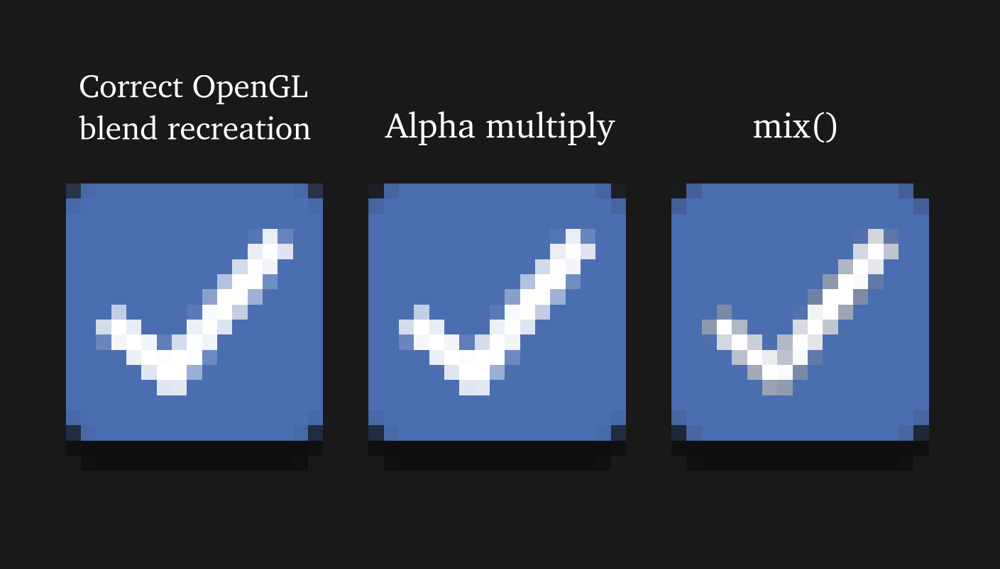

## My configuration files
`tf2-config/autoexec.cfg` is a config file for Team Fortress 2\
`cs2-config/autoexec.cfg` is a config file for Counter-Strike 2\
Copy the `kiva-vital-presets` into `~/.local/share/vital` to get the Vital synth presets

Use `lxappearance` to customize system-wide GTK theme (requires restarting to show up in firefox, pavucontrol etc.)

That one program I keep forgetting the name of: `sudo apt install binwalk`

## Home folder structure
```
~/dotfiles   github.com/kivattt/dotfiles
~/tutils2    github.com/kivattt/tutils2
~/rainbowize github.com/kivattt/rainbowize

~/main              Where the terminal starts at
~/main/wallpapers   Desktop background images
~/main/etc/torrents Pirated movies/music
~/main/projects     Code projects, repos
```

<details>
<summary>Sway / Wayland shenanigans</summary>

Remember to install:\
```
sudo apt install swaylock grim slurp wl-clipboard jq
```

`arandr` alternative: `sudo apt install wdisplays`\
`xev` alternative: `sudo apt install wev`

Installing OBS studio:
```
sudo apt install pipewire xdg-desktop-portal xdg-desktop-portal-wlr
sudo apt remove xdg-desktop-portal-gtk
systemctl reboot # Reboot the computer at this point
./run_sway.sh # Starts sway with `XDG_CURRENT_DESKTOP=sway`
```
</details>

<details>
<summary>Intellij IDEA settings</summary>

Theme: [Darcula Pitch Black](https://plugins.jetbrains.com/plugin/14059-darcula-pitch-black)\
File -> Settings -> Appearance & Behavior -> Appearance -> Click to enable "Show main menu in separate toolbar"
</details>

<details>
<summary>Installing the JetBrains Mono font (for XTerm and i3wm)</summary>

```bash
cd ~/Downloads
mkdir JetBrainsMono
cd JetBrainsMono
wget https://download.jetbrains.com/fonts/JetBrainsMono-2.304.zip
unzip JetBrainsMono-2.304.zip
mv fonts/ttf fonts/JetBrainsMono
```

Now, on Linux:
```
sudo cp -r fonts/JetBrainsMono /usr/share/fonts/truetype
rm -rf ~/Downloads/JetBrainsMono
```

Otherwise, on FreeBSD:
```
sudo cp fonts/JetBrainsMono/* ~/.fonts
rm -rf ~/Downloads/JetBrainsMono
```
</details>

<details>
<summary>Installing SDL3 on Linux</summary>

Follow the instructions here: https://glusoft.com/sdl3-tutorials/install-sdl3-linux
```
unzip SDL3-3.2.14.zip # Download from https://github.com/libsdl-org/SDL/releases

mkdir build
cd build
cmake ..
make
sudo make install

# Now, copy the like /usr/local/lib .so files/symlinks to the working directory where you run your sdl3 program from
```
</details>

<details>
<summary>Firefox extensions</summary>

[uBlock Origin](https://addons.mozilla.org/en-US/firefox/addon/ublock-origin/)\
[SponsorBlock](https://addons.mozilla.org/en-US/firefox/addon/sponsorblock/)\
[Dark Reader](https://addons.mozilla.org/en-US/firefox/addon/darkreader/)\
[Return YouTube Dislike](https://addons.mozilla.org/en-US/firefox/addon/return-youtube-dislikes/)
</details>

<details>
<summary>Enabling 75hz on Asus monitor</summary>

Just add `--rate 75` in `~/.screenlayout/main.sh` for the correct output\
Google should permanently remove this from their search results: https://askubuntu.com/a/59626
</details>

<details>
<summary>Fixing monitor not recognized/flickering every 5 sec</summary>

Remove `--rate 75` from `~/screenlayout/main.sh`, run it, put back `--rate 75` and run it again.
</details>

<details>
<summary>Installing Go on Linux</summary>

Based on https://go.dev/doc/install

[Download the latest .tar.gz release](https://go.dev/dl/), then:
```bash
cd ~/Downloads
sudo rm -rf /usr/local/go && sudo tar -C /usr/local -xzf go*.linux-amd64.tar.gz
```

Now add this line to the end of `/etc/profile`:
```
export PATH=$PATH:/usr/local/go/bin
```
Log out (Alt+E in i3wm) then back in again, do `go version` to verify it successfully installed
</details>

<details>
<summary>Profiling C/C++/Odin with valgrind + kcachegrind</summary>

```bash
# Remember to build your code with debug symbols enabled
# C/C++ : -g     (and optionally -O0)
# Odin  : -debug (and optionally -o:none)
valgrind --tool=callgrind ./your-program <arguments>

kcachegrind callgrind.out.1387577 # The file generated by valgrind
```
</details>

<details>
<summary>Building & profiling Git with valgrind + kcachegrind</summary>

```bash
git clone https://github.com/git/git
cd git
sudo apt install libssl-dev
# Now open the Makefile, search for '-O2' and replace it with '-O0'
make
valgrind --tool=callgrind --trace-children=yes ./bin-wrappers/git <SUB-COMMAND>

kcachegrind callgrind.out.1387577 # The file generated by valgrind
```
</details>

<details>
<summary>Flamegraph profiling C++ with uftrace </summary>

```bash
sudo apt install uftrace
# Now compile with the -pg flags
uftrace record ./your-program <args>
uftrace dump --flame-graph > flamegraph.txt
wget "https://raw.githubusercontent.com/brendangregg/FlameGraph/refs/heads/master/flamegraph.pl"
chmod +x flamegraph.pl
./flamegraph.pl flamegraph.txt > graph.svg
firefox graph.svg
```
</details>

<details>
<summary>Profiling C/C++/Go with Intel VTune profiler</summary>

[Install with apt](https://www.intel.com/content/www/us/en/developer/tools/oneapi/vtune-profiler-download.html?operatingsystem=linux&linux-install-type=apt), described below
```bash
sudo apt update
sudo apt install -y gpg-agent wget
wget -O- https://apt.repos.intel.com/intel-gpg-keys/GPG-PUB-KEY-INTEL-SW-PRODUCTS.PUB | gpg --dearmor | sudo tee /usr/share/keyrings/oneapi-archive-keyring.gpg > /dev/null
echo "deb [signed-by=/usr/share/keyrings/oneapi-archive-keyring.gpg] https://apt.repos.intel.com/oneapi all main" | sudo tee /etc/apt/sources.list.d/oneAPI.list
sudo apt update
sudo apt install intel-oneapi-vtune
```

Now, self-check and run `vtune-gui`
```bash
source /opt/intel/oneapi/vtune/latest/env/vars.sh
cd /opt/intel/oneapi/vtune/latest/bin64

# Run a self-check
sudo ./vtune-self-checker.sh

xhost + # This is required to allow root to connect to X11
sudo ./vtune-gui
```
</details>

<details>
<summary>Golang Memory/CPU profiling</summary>

```go
import (
    "github.com/pkg/profile"
)

func main() {
    // Generate a .pprof CPU profile file on program exit
    defer profile.Start(profile.CPUProfile).Stop()

    // Generate a .pprof memory profile file on program exit
    defer profile.Start(profile.MemProfile).Stop()
}
```
</details>

<details>
<summary>Getting Ghidra to run</summary>

```bash
sudo apt install openjdk-21-jdk
```
</details>

<details>
<summary>Installing latest Neovim</summary>

See: https://github.com/neovim/neovim/blob/master/INSTALL.md#linux
```
curl -LO https://github.com/neovim/neovim/releases/latest/download/nvim-linux-x86_64.tar.gz
sudo rm -rf /opt/nvim
sudo tar -C /opt -xzf nvim-linux-x86_64.tar.gz
```

Then add to .bashrc
```
export PATH="$PATH:/opt/nvim-linux-x86_64/bin"
```
</details>

<details>
<summary>GLSL Color blend functions</summary>

</img>

OpenGL default blend mode recreation (correct color blending, works with default OpenGL blending)
```glsl
// Disclaimer: this function was written by Github Copilot
vec4 blend(vec4 src, vec4 dst) {
    float outAlpha = src.a + dst.a * (1.0 - src.a);
    vec3 outColor = (src.rgb * src.a + dst.rgb * dst.a * (1.0 - src.a)) / max(outAlpha, 1e-6);
    return vec4(outColor, outAlpha);
}
```

Alpha Multiply (correct standalone color blending(?), but doesn't match well when combined with default OpenGL blending)
```glsl
vec4 alphaMultiply(vec4 src, vec4 dst) {
    vec4 res;
    res.r = dst.r * (1 - src.a) + src.r * src.a;
    res.g = dst.g * (1 - src.a) + src.g * src.a;
    res.b = dst.b * (1 - src.a) + src.b * src.a;
    res.a = dst.a * (1 - src.a) + src.a;

    return res;
}
```

Mix (terrible, awful, never use this.)
```glsl
mix(dst, src, src.a);
```
</details>
